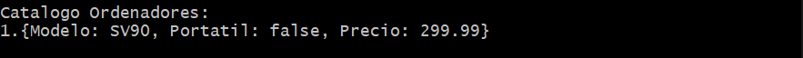
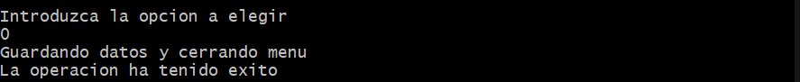
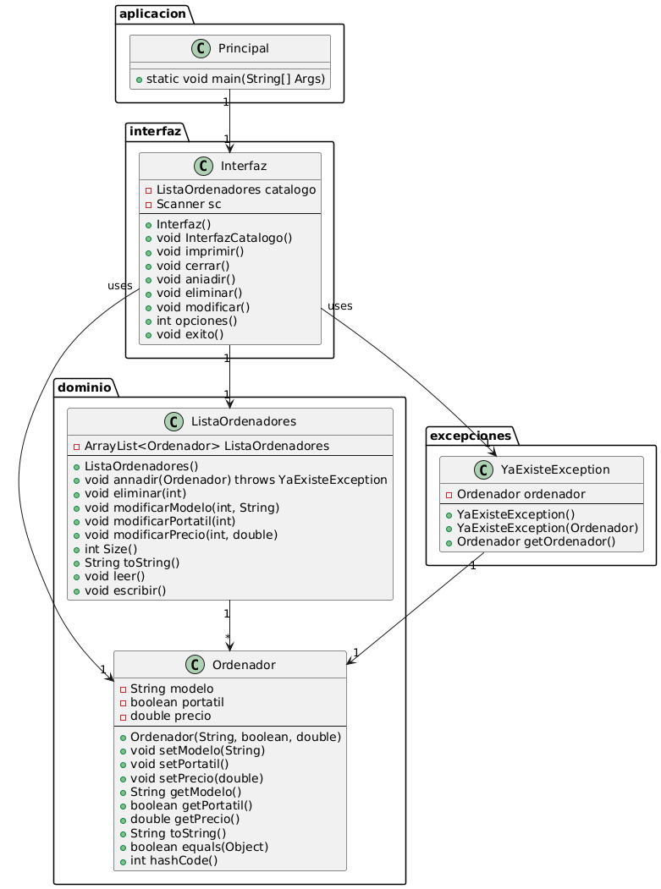

#CATALOGO DE ORDENADORES

## Descripción

Este programa crea un catalogo de ordenadores que guarda los datos en un fichero .dat que a su vez podemos modificar o leer por 
pantalla mediante la interfaz de texto del programa. Otras funciones son las de añadir nuevos ordenadores al catálogo o eliminarlos
del mismo. El objetivo de este programa es hacer mas fácil la interaccion con los datos  y asegurar la fiabilidad de los datos ya que el programa evita la introducción
de datos inválidos y guía al usuario para indicarle como proceder para cada una de las acciones posibles.
Creado por Joaquin De Vicente Abad.

## Instalación

Requesitos previos: Tener instalado java. Para comprobar nuestra instalacion ejecutaremos el comando "java --version"
Para instalar el programa descarga y mueve al directorio pertinente el archivo .jar. Una vez preparado hay que abrir la consola de 
comandos y movernos hasta el directorio. Una vez dentro ejecutar el siguiente comando: "-java -jar Main.jar" que procedera a ejecutar
el codigo.

## Ejemplos de uso

Una vez tenemos el codigo en ejecucion veremos el siguiente contenido:

Para mostrar lo que tenemos en nuestro catalogo introduciremos el numero correspondiente: 1

Introducimos un nuevo ordenador en nuestro catalogo: 2

Por ultimo modificamos para indicar que el segundo elemento no se trata de un portatil

Cerramos el programa y se guardan los datos.

## Estructura

El código esta dividido en tres paquetes. Uno llamando aplicacion con nuestra clase main. Otro llamado dominio donde se define la clase
Ordenador y su clase ArrayList ListaOrdenadores. Por ultimo el paquete interfaz con la clase Interfaz.

## Contribuciones

Proyecto desarrollado en solitario.

## Licencia
Este proyecto está licenciado bajo la Apache License 2.0.